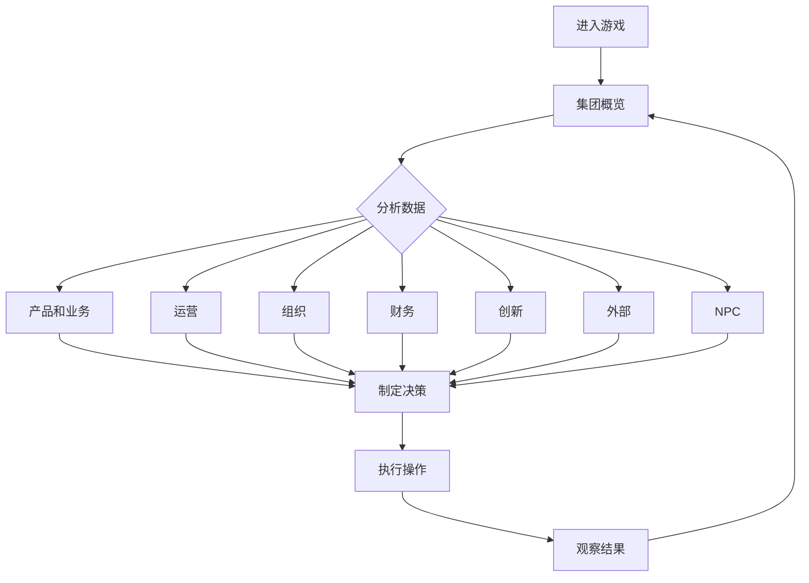

## 1. Product Overview

一个沉浸式的公司模拟经营游戏界面，玩家扮演企业管理者，通过决策和策略经营一家虚拟企业。目标用户为喜欢策略模拟类游戏的玩家，提供真实的企业运营体验和深度策略玩法。

## 2. Core Features

### 2.1 User Roles
| Role | Registration Method | Core Permissions |
|------|---------------------|------------------|
| Player | 本地存档 | 管理企业所有模块，制定经营策略 |

### 2.2 Feature Module
1. **集团概览**: 企业整体状态、关键指标仪表盘
2. **产品和业务**: 产品开发、产品线管理、市场定位
3. **运营**: 日常运营管理、流程优化、效率监控
4. **组织**: 人员管理、部门架构、团队配置
5. **财务**: 资金管理、收支分析、投资决策
6. **创新**: 研发投入、技术突破、专利管理
7. **外部**: 市场环境、竞争对手、政策法规
8. **NPC**: 虚拟角色互动、谈判、合作

### 2.3 Page Details
| Page Name | Module Name | Feature description |
|-----------|-------------|---------------------|
| 集团概览 | 仪表盘 | 显示企业核心指标（市值、营收、员工数等），趋势图表，快速导航 |
| 产品和业务 | 产品列表 | 展示所有产品线，支持创建、编辑、删除产品 |
| 产品和业务 | 产品详情 | 单个产品的详细信息，包括研发进度、市场表现、改进建议 |
| 运营 | 运营看板 | 日常运营任务管理，效率指标监控，流程优化工具 |
| 组织 | 组织架构 | 部门层级展示，人员编制管理，角色分配 |
| 组织 | 员工管理 | 员工列表，招聘、培训、绩效考核 |
| 财务 | 财务报表 | 资产负债表、利润表、现金流量表 |
| 财务 | 投资决策 | 投资机会列表，风险评估，资金调配 |
| 创新 | 研发中心 | 研发项目管理，技术路线图，专利申请 |
| 外部 | 市场情报 | 市场动态、竞争对手分析、行业报告 |
| 外部 | 政策法规 | 政策变化、合规要求、审批流程 |
| NPC | 角色列表 | 可互动的NPC角色，关系管理，对话系统 |

## 3. Core Process

玩家进入游戏后，首先查看集团概览了解企业现状，然后根据需要在各模块间切换，制定经营策略。主要流程包括：查看状态 → 分析数据 → 制定决策 → 执行操作 → 观察结果。

## 4. User Interface Design

### 4.1 Design Style
- **Primary Color**: 深邃的海军蓝 (#0a1628)，象征企业的稳重与专业
- **Secondary Color**: 金色 (#ffd700)，象征财富与成就
- **Accent Color**: 翠绿色 (#00ff88)，象征创新与增长
- **Button Style**: 圆角矩形，渐变背景，悬停时有光影效果
- **Font**: 现代无衬线字体，标题使用粗体，正文使用常规体
- **Layout Style**: 左侧导航栏 + 右侧内容区，卡片式布局
- **Icon Style**: 线性图标，简洁现代

### 4.2 Page Design Overview
| Page Name | Module Name | UI Elements |
|-----------|-------------|-------------|
| 集团概览 | 仪表盘 | 圆形进度指标、折线趋势图、KPI卡片、快速入口按钮 |
| 产品和业务 | 产品列表 | 产品卡片网格、筛选器、添加产品按钮 |
| 运营 | 运营看板 | 任务列表、甘特图、效率仪表盘 |
| 组织 | 组织架构 | 层级树形图、部门卡片、人员头像 |
| 财务 | 财务报表 | 表格数据、饼图、财务健康指标 |
| 创新 | 研发中心 | 项目时间线、技术雷达图、进度条 |
| 外部 | 市场情报 | 新闻列表、竞争对比图表、趋势分析 |
| NPC | 角色列表 | 角色头像卡片、关系进度条、对话入口 |

### 4.3 Responsiveness
- **Desktop-first**: 1920x1080 基准分辨率
- **Tablet-adaptive**: 1280x720 自适应布局
- **Mobile-optimized**: 响应式导航，内容滚动优化

### 4.4 Interactions and Animations
- 页面切换平滑过渡
- 卡片悬停缩放效果
- 数据更新动画
- 进度条动态填充
- 模态框淡入淡出

## 5. Technical Requirements
- 纯前端实现，无需后端
- 响应式设计
- 现代CSS动画效果
- 模拟数据展示
- 模块化代码结构