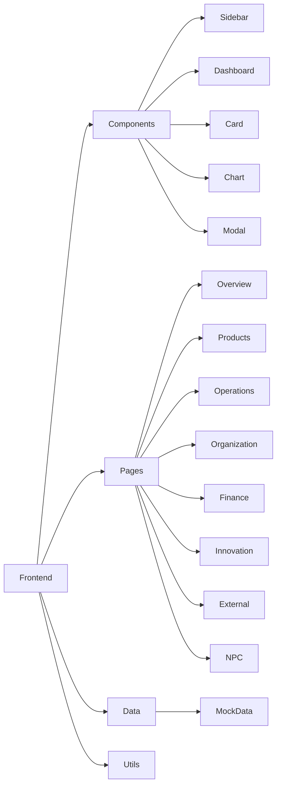

## 1. Architecture Design



## 2. Technology Description
- **Frontend**: React@18 + TailwindCSS@3 + Vite
- **Initialization Tool**: vite-init
- **Backend**: None (纯前端)
- **Icons**: Lucide React
- **State Management**: Zustand

## 3. Route Definitions
| Route | Purpose |
|-------|---------|
| / | 集团概览页面 |
| /products | 产品和业务页面 |
| /operations | 运营页面 |
| /organization | 组织页面 |
| /finance | 财务页面 |
| /innovation | 创新页面 |
| /external | 外部页面 |
| /npc | NPC页面 |

## 4. Project Structure
```
src/
├── components/
│   ├── Sidebar/
│   │   └── index.tsx
│   ├── Dashboard/
│   │   └── index.tsx
│   ├── Card/
│   │   └── index.tsx
│   ├── Chart/
│   │   └── index.tsx
│   ├── Modal/
│   │   └── index.tsx
│   └── Layout/
│       └── index.tsx
├── pages/
│   ├── Overview/
│   │   └── index.tsx
│   ├── Products/
│   │   └── index.tsx
│   ├── Operations/
│   │   └── index.tsx
│   ├── Organization/
│   │   └── index.tsx
│   ├── Finance/
│   │   └── index.tsx
│   ├── Innovation/
│   │   └── index.tsx
│   ├── External/
│   │   └── index.tsx
│   └── NPC/
│       └── index.tsx
├── data/
│   └── mockData.ts
├── stores/
│   └── gameStore.ts
├── utils/
│   └── helpers.ts
├── App.tsx
├── main.tsx
└── index.css
```

## 5. Component Design

### 5.1 Sidebar Component
- 固定左侧导航
- 8个导航项（集团概览、产品和业务、运营、组织、财务、创新、外部、NPC）
- 激活状态高亮
- 悬停效果

### 5.2 Dashboard Component
- 圆形进度指标组件
- KPI卡片组件
- 趋势图表组件
- 快速入口按钮

### 5.3 Card Component
- 通用卡片容器
- 标题、内容区域
- 悬停缩放效果

### 5.4 Modal Component
- 通用模态框
- 标题、内容、操作按钮
- 淡入淡出动画

## 6. Data Model

### 6.1 企业数据模型
```typescript
interface Company {
  id: string;
  name: string;
  industry: string;
  marketValue: number;
  revenue: number;
  profit: number;
  employees: number;
  foundedYear: number;
  rating: number;
}
```

### 6.2 产品数据模型
```typescript
interface Product {
  id: string;
  name: string;
  category: string;
  developmentProgress: number;
  marketShare: number;
  revenue: number;
  status: 'development' | 'launched' | 'declining';
}
```

### 6.3 员工数据模型
```typescript
interface Employee {
  id: string;
  name: string;
  avatar: string;
  role: string;
  department: string;
  salary: number;
  performance: number;
}
```

### 6.4 财务数据模型
```typescript
interface Finance {
  cash: number;
  assets: number;
  liabilities: number;
  equity: number;
  revenue: number;
  expenses: number;
  profit: number;
}
```

### 6.5 NPC数据模型
```typescript
interface NPC {
  id: string;
  name: string;
  avatar: string;
  role: string;
  company: string;
  relationship: number;
  personality: string;
}
```

## 7. CSS Design

### 7.1 颜色变量
```css
:root {
  --primary: #0a1628;
  --secondary: #1a2a44;
  --accent-gold: #ffd700;
  --accent-green: #00ff88;
  --text-primary: #ffffff;
  --text-secondary: #a0aec0;
  --success: #48bb78;
  --warning: #ed8936;
  --danger: #fc8181;
}
```

### 7.2 字体变量
```css
:root {
  --font-family: 'Inter', system-ui, sans-serif;
  --font-size-xs: 0.75rem;
  --font-size-sm: 0.875rem;
  --font-size-base: 1rem;
  --font-size-lg: 1.125rem;
  --font-size-xl: 1.25rem;
  --font-size-2xl: 1.5rem;
  --font-size-3xl: 1.875rem;
}
```

### 7.3 间距变量
```css
:root {
  --spacing-xs: 0.25rem;
  --spacing-sm: 0.5rem;
  --spacing-md: 1rem;
  --spacing-lg: 1.5rem;
  --spacing-xl: 2rem;
  --spacing-2xl: 3rem;
}
```

## 8. State Management

使用Zustand管理游戏状态：
- 当前选中的页面
- 企业数据
- 产品列表
- 员工列表
- 财务数据
- NPC列表
- UI状态（模态框显示/隐藏）

## 9. Mock Data

所有数据使用模拟数据，存储在 `src/data/mockData.ts` 中，包括：
- 企业基本信息
- 产品列表（5-8个产品）
- 员工列表（20-30名员工）
- 财务报表数据
- 研发项目
- 市场情报
- NPC角色（10-15个）